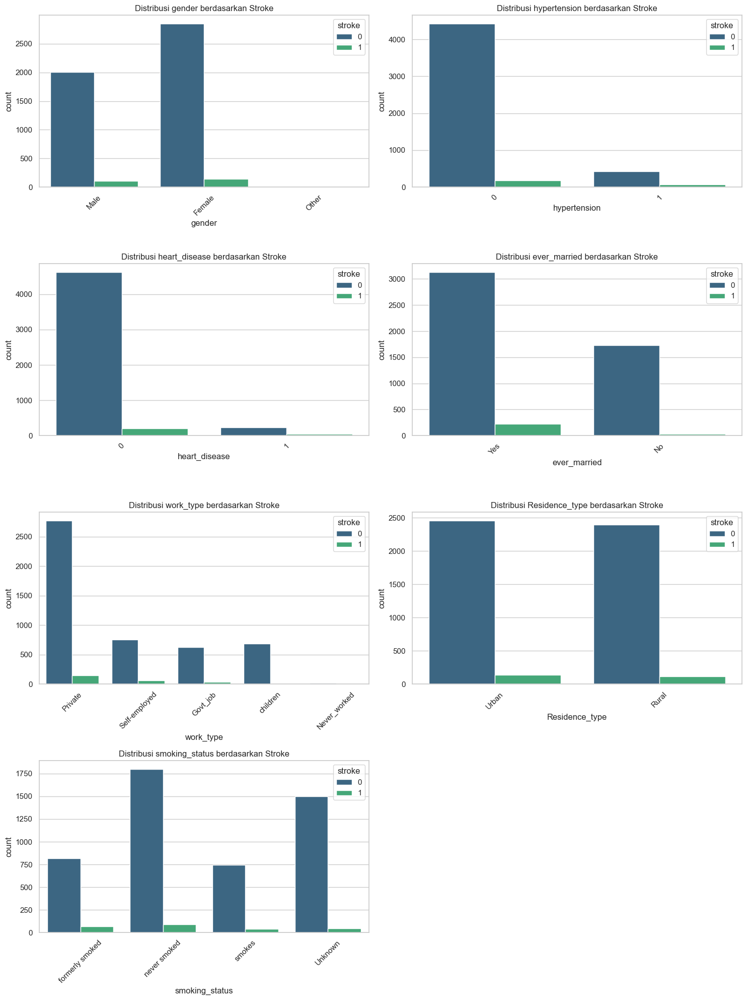
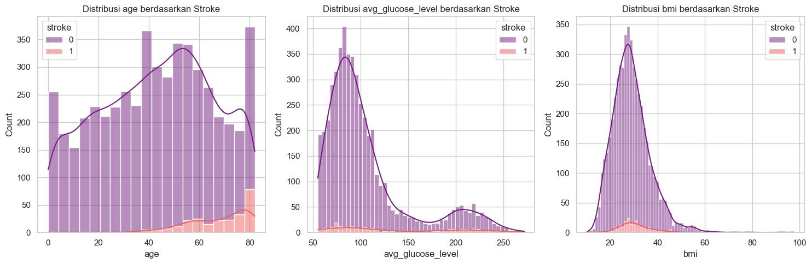
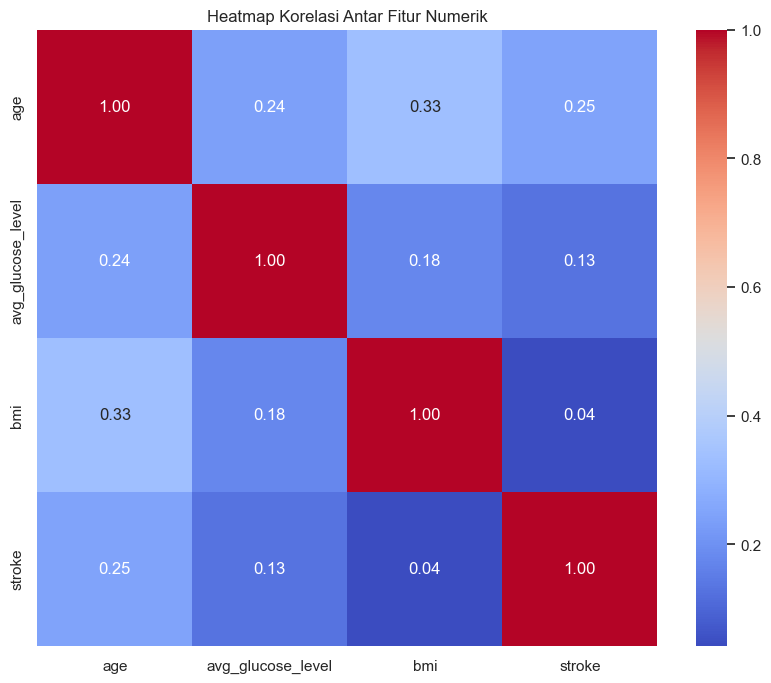

# Laporan Proyek Predictive Analytics: Prediksi Risiko Stroke

- **Nama:** Maulana Seno Aji Yudhantara
- **Email:** senoaji115@gmail.com
- **ID Dicoding:** bang_aji
- **Cohort ID Coding Camp:** MC117D5Y1789

## 1. Domain Proyek

Stroke adalah kondisi medis serius yang terjadi ketika pasokan darah ke bagian otak terputus, yang mengakibatkan kerusakan sel-sel otak. Menurut World Health Organization (WHO), stroke merupakan penyebab kematian kedua terbesar secara global dan penyebab utama kecacatan jangka panjang. Prediksi dini terhadap individu yang berisiko tinggi sangat krusial karena memungkinkan dilakukannya tindakan pencegahan, seperti perubahan gaya hidup dan intervensi medis, yang dapat secara signifikan mengurangi kemungkinan terjadinya stroke.

Proyek *predictive analytics* ini berfokus pada domain **kesehatan** dengan tujuan membangun sebuah model klasifikasi yang mampu mengidentifikasi pasien dengan risiko stroke tinggi berdasarkan data demografis, riwayat kesehatan, dan gaya hidup mereka. Model ini diharapkan dapat menjadi alat bantu bagi para profesional medis dalam proses skrining awal.

## 2. Business Understanding

### 2.1. Problem Statement

- Faktor-faktor apa saja yang paling signifikan dalam menentukan risiko stroke pada seorang pasien?
- Bagaimana cara membangun sebuah model *machine learning* yang dapat memprediksi risiko stroke dengan akurat, terutama dalam mengidentifikasi kasus-kasus positif?

### 2.2. Goals

- Mengidentifikasi variabel-variabel kunci yang menjadi prediktor kuat untuk risiko stroke dari dataset yang tersedia.
- Mengembangkan model klasifikasi yang memiliki performa terbaik, dengan fokus pada metrik evaluasi yang paling relevan untuk konteks medis, yaitu kemampuan untuk meminimalkan kasus yang terlewatkan (*false negatives*).

### 2.3. Solution Statement

Untuk mencapai tujuan tersebut, serangkaian solusi akan diimplementasikan:
1.  Melakukan analisis data eksplorasi (EDA) untuk memahami karakteristik dan pola dalam data.
2.  Melakukan persiapan data yang komprehensif, termasuk penanganan nilai yang hilang, *encoding* fitur kategorikal, dan penanganan ketidakseimbangan kelas menggunakan teknik *oversampling* SMOTE.
3.  Mengembangkan beberapa model klasifikasi *machine learning* untuk dibandingkan performanya. Algoritma yang digunakan meliputi Logistic Regression (sebagai *baseline*), K-Nearest Neighbors (KNN), Random Forest, dan Support Vector Machine (SVM).
4.  Mengevaluasi model-model tersebut berdasarkan metrik yang paling relevan untuk masalah medis (terutama **Recall**) dan memilih model terbaik sebagai solusi akhir.

## 3. Data Understanding

### 3.1. Sumber Data

Dataset yang digunakan dalam proyek ini adalah **"Stroke Prediction Dataset"** yang bersumber dari platform Kaggle.
- **Tautan:** [https://www.kaggle.com/datasets/fedesoriano/stroke-prediction-dataset](https://www.kaggle.com/datasets/fedesoriano/stroke-prediction-dataset)

Dataset ini terdiri dari **5110 sampel** dan **12 fitur** yang relevan untuk prediksi stroke.

### 3.2. Penjelasan Variabel

- **id**: Nomor identitas unik pasien.
- **gender**: Jenis kelamin pasien ('Male', 'Female', atau 'Other').
- **age**: Usia pasien dalam tahun.
- **hypertension**: 0 jika pasien tidak memiliki hipertensi, 1 jika memiliki hipertensi.
- **heart_disease**: 0 jika pasien tidak memiliki penyakit jantung, 1 jika memiliki penyakit jantung.
- **ever_married**: Status pernikahan pasien ('No' atau 'Yes').
- **work_type**: Jenis pekerjaan pasien ('children', 'Govt_job', 'Never_worked', 'Private', atau 'Self-employed').
- **Residence_type**: Tipe tempat tinggal pasien ('Rural' atau 'Urban').
- **avg_glucose_level**: Rata-rata kadar glukosa dalam darah.
- **bmi**: Indeks massa tubuh (Body Mass Index).
- **smoking_status**: Status merokok pasien ('formerly smoked', 'never smoked', 'smokes', atau 'Unknown').
- **stroke**: Variabel target; 1 jika pasien mengalami stroke, 0 jika tidak.

### 3.3. Exploratory Data Analysis (EDA)

P### 3.3. Exploratory Data Analysis (EDA)

Pada tahap EDA, beberapa temuan kunci berhasil diidentifikasi melalui serangkaian visualisasi berikut.

*Gambar 1. Distribusi variabel target `stroke` yang menunjukkan ketidakseimbangan data.*

*Gambar 2. Perbandingan risiko stroke pada setiap fitur kategorikal.*

*Gambar 3. Perbandingan distribusi fitur numerik antara pasien stroke dan non-stroke.*

*Gambar 4. Heatmap korelasi antar fitur numerik.*

Dari visualisasi di atas, dapat disimpulkan:
- **Imbalanced Dataset**: Dataset sangat tidak seimbang. Dari 5110 data, hanya terdapat **249 kasus stroke (4.87%)**. Hal ini memerlukan penanganan khusus seperti SMOTE.
- **Faktor Usia**: Usia adalah prediktor terkuat, di mana mayoritas pasien stroke berusia di atas 60 tahun.
- **Faktor Kondisi Medis**: Pasien dengan riwayat hipertensi dan penyakit jantung memiliki proporsi kasus stroke yang jauh lebih tinggi.
- **Pengaruh Glukosa dan BMI**: `avg_glucose_level` yang tinggi cenderung berhubungan dengan risiko stroke, sementara `bmi` tidak menunjukkan perbedaan yang jelas.
- **Missing Values**: Ditemukan **201 nilai yang hilang** pada kolom `bmi`.

## 4. Data Preparation

Proses persiapan data dilakukan melalui beberapa tahapan untuk memastikan data bersih dan siap untuk pemodelan. Alur kerja pada tahap ini adalah sebagai berikut:
1.  **Penghapusan Kolom Tidak Relevan**: Kolom `id` dihapus dari dataset. Kolom ini hanya berfungsi sebagai pengidentifikasi unik untuk setiap pasien dan tidak memiliki nilai prediktif apa pun terhadap variabel target, sehingga tidak akan diikutsertakan dalam proses pemodelan.
2.  **Penanganan Anomali Data**: Satu baris data dengan `gender` 'Other' dihapus. Karena jumlahnya hanya satu, data ini dianggap sebagai anomali atau *noise* yang tidak akan memberikan kontribusi signifikan secara statistik pada model.
3.  **Imputasi Missing Values**: Terdapat 201 nilai yang hilang pada kolom `bmi`. Nilai-nilai ini diisi (diimputasi) menggunakan nilai **median** dari kolom tersebut. Median dipilih karena lebih robust terhadap *outliers* dibandingkan dengan nilai rata-rata (mean).
4.  **Encoding Fitur Kategorikal**: Fitur-fitur kategorikal (`gender`, `ever_married`, dll.) yang masih dalam format teks diubah menjadi representasi numerik menggunakan teknik **One-Hot Encoding**. Ini menciptakan kolom biner baru untuk setiap kategori, memungkinkan model untuk memprosesnya.
5.  **Penskalaan Fitur Numerik**: Seluruh fitur numerik (`age`, `avg_glucose_level`, `bmi`) diskalakan menggunakan **StandardScaler**. Tujuannya adalah untuk menyeragamkan rentang nilai setiap fitur (menjadi berpusat di 0 dengan standar deviasi 1) agar fitur dengan rentang nilai besar tidak mendominasi proses pelatihan model.
6.  **Train-Test Split**: Dataset dibagi menjadi data latih (80%) dan data uji (20%). Parameter `stratify=y` digunakan untuk memastikan proporsi kelas target (stroke dan non-stroke) tetap sama di kedua set, yang sangat penting untuk dataset yang tidak seimbang.
7.  **Penanganan Ketidakseimbangan Data**: Teknik **SMOTE** (*Synthetic Minority Over-sampling Technique*) diterapkan **hanya pada data latih**. SMOTE bekerja dengan membuat sampel sintetis dari kelas minoritas (stroke) untuk menyeimbangkan jumlahnya dengan kelas mayoritas. Ini dilakukan setelah pembagian data untuk mencegah kebocoran data (*data leakage*).

## 5. Modeling

Pada tahap ini, beberapa model machine learning dilatih dan dievaluasi untuk menemukan solusi terbaik. Setiap model memiliki mekanisme kerja dan karakteristik yang berbeda.

### 5.1. Logistic Regression

-   **Cara Kerja**: Logistic Regression adalah model linear yang digunakan untuk masalah klasifikasi biner. Model ini memprediksi probabilitas sebuah data termasuk dalam kelas tertentu (misalnya, kelas '1' atau 'stroke') dengan melewatkan kombinasi linear dari fitur-fitur input ke dalam fungsi logistik (sigmoid). Fungsi sigmoid akan menghasilkan nilai antara 0 dan 1, yang kemudian dapat diinterpretasikan sebagai probabilitas.
-   **Parameter yang Digunakan**: `random_state=42` untuk memastikan reproduktifitas hasil. Parameter lainnya menggunakan nilai default dari library scikit-learn.
-   **Kelebihan**: Cepat, efisien secara komputasi, dan hasilnya mudah diinterpretasikan.
-   **Kekurangan**: Cenderung kurang akurat jika hubungan antara fitur dan target bersifat non-linear, serta rentan terhadap *underfitting*.

### 5.2. K-Nearest Neighbors (KNN)

-   **Cara Kerja**: KNN adalah algoritma non-parametrik yang mengklasifikasikan data baru berdasarkan mayoritas kelas dari 'k' tetangga terdekatnya di ruang fitur. Jarak antar data dihitung menggunakan metrik tertentu (misalnya, Jarak Euclidean). Saat memprediksi, algoritma akan mencari 'k' sampel data latih yang paling mirip (paling dekat) dengan data baru, lalu menentukan kelasnya berdasarkan voting mayoritas dari tetangga-tetangga tersebut.
-   **Parameter yang Digunakan**: Menggunakan parameter default dari scikit-learn, di antaranya `n_neighbors=5`.
-   **Kelebihan**: Sederhana, mudah diimplementasikan, dan efektif untuk data dengan hubungan non-linear.
-   **Kekurangan**: Membutuhkan banyak memori dan komputasi saat prediksi (karena harus menghitung jarak ke semua data latih), serta sangat sensitif terhadap skala fitur.

### 5.3. Random Forest

-   **Cara Kerja**: Random Forest adalah model *ensemble* yang terdiri dari banyak *decision tree* (pohon keputusan). Setiap pohon dalam "hutan" ini dilatih pada sampel acak dari dataset (*bootstrap sample*). Saat membuat prediksi, setiap pohon memberikan prediksinya masing-masing, dan hasil akhir ditentukan oleh voting mayoritas dari semua pohon. Pendekatan ini membantu mengurangi *overfitting* yang sering terjadi pada satu *decision tree* dan meningkatkan akurasi model secara keseluruhan.
-   **Parameter yang Digunakan**: `random_state=42` untuk memastikan proses acak dalam pembuatan pohon dapat direproduksi. Parameter lainnya menggunakan nilai default.
-   **Kelebihan**: Sangat akurat, performanya kuat, tahan terhadap *overfitting*, dan dapat menangani hubungan non-linear dengan baik.
-   **Kekurangan**: Kurang dapat diinterpretasikan (bersifat *black box*) dan membutuhkan lebih banyak sumber daya komputasi dibandingkan model tunggal.

### 5.4. Support Vector Machine (SVM)

-   **Cara Kerja**: SVM bekerja dengan mencari *hyperplane* (atau garis pemisah) optimal yang dapat memisahkan data ke dalam kelas-kelas yang berbeda. Tujuannya adalah untuk menemukan *hyperplane* dengan margin (jarak) terbesar antara titik data terdekat dari setiap kelas (disebut *support vectors*). Dengan memaksimalkan margin, SVM dapat menghasilkan batas keputusan yang jelas dan memiliki kemampuan generalisasi yang baik.
-   **Parameter yang Digunakan**: `random_state=42` untuk reproduktifitas. Parameter lainnya menggunakan nilai default dari scikit-learn.
-   **Kelebihan**: Sangat efektif pada data berdimensi tinggi dan efisien dalam penggunaan memori karena hanya menggunakan subset titik data (support vectors).
-   **Kekurangan**: Kurang efisien pada dataset yang sangat besar dan bisa jadi sulit diinterpretasikan.

Setelah melatih keempat model pada data latih yang telah diproses, performa mereka dievaluasi pada data uji.

## 6. Evaluation

### 6.1. Metrik Evaluasi

Untuk mengevaluasi model pada masalah klasifikasi yang tidak seimbang ini, metrik berikut digunakan:
- **Accuracy**: Persentase total prediksi yang benar.
- **Precision**: Dari semua yang diprediksi positif, berapa persen yang benar-benar positif.
- **Recall (Sensitivity)**: Dari semua kasus positif yang sebenarnya, berapa persen yang berhasil diidentifikasi oleh model.
- **F1-Score**: Rata-rata harmonik dari Precision dan Recall.

Dalam konteks medis, **Recall adalah metrik yang paling krusial**. Gagal mendeteksi pasien yang berisiko stroke (False Negative) memiliki konsekuensi yang jauh lebih fatal daripada keliru memprediksi pasien sehat sebagai berisiko (False Positive).

### 6.2. Hasil Evaluasi

Berikut adalah tabel perbandingan performa dari keempat model pada data uji:

| Model | Accuracy | Precision (stroke=1) | Recall (stroke=1) | F1-Score (stroke=1) |
| :--- | :--- | :--- | :--- | :--- |
| **Logistic Regression**| 0.740 | 0.135 | **0.800** | 0.231 |
| **KNN** | 0.817 | 0.103 | 0.360 | 0.161 |
| **Random Forest** | **0.934** | **0.185** | 0.100 | 0.129 |
| **SVM** | 0.771 | 0.110 | 0.520 | 0.181 |

 

Visualisasi dari hasil evaluasi dapat dilihat pada gambar-gambar di bawah ini.

**Confusion Matrix dari Setiap Model**

| Logistic Regression | K-Nearest Neighbors |
|:---:|:---:|
|  |  |
| **Random Forest** | **Support Vector Machine** |
|  |  |

*Gambar 5. Confusion matrix dari keempat model yang menunjukkan distribusi True Positive, True Negative, False Positive, dan False Negative.*

 

**Grafik Perbandingan Metrik Antar Model**

*Gambar 6. Perbandingan metrik evaluasi utama yang menyoroti keunggulan Recall pada model Logistic Regression.*

### 6.3. Pemilihan Model Terbaik

Berdasarkan hasil evaluasi, **Logistic Regression dipilih sebagai model terbaik** untuk proyek ini.

**Justifikasi:**
Meskipun Random Forest memiliki akurasi tertinggi, performa **Recall-nya sangat buruk (0.10)**, yang berarti model ini gagal mengidentifikasi 90% pasien stroke. Sebaliknya, **Logistic Regression** berhasil mencapai **Recall sebesar 0.80**, yang berarti model ini mampu mendeteksi 80% dari total kasus stroke pada data uji. Kemampuannya untuk meminimalkan *False Negative* menjadikannya pilihan yang paling aman dan paling bertanggung jawab untuk aplikasi di dunia nyata dalam konteks medis, meskipun harus mengorbankan presisi.

## 7. Daftar Referensi
World Health Organization. (2025). _Stroke, cerebrovascular accident_. WHO. [https://www.who.int/news-room/fact-sheets/detail/stroke-cerebrovascular-accident](https://www.emro.who.int/health-topics/stroke-cerebrovascular-accident/index.html)
